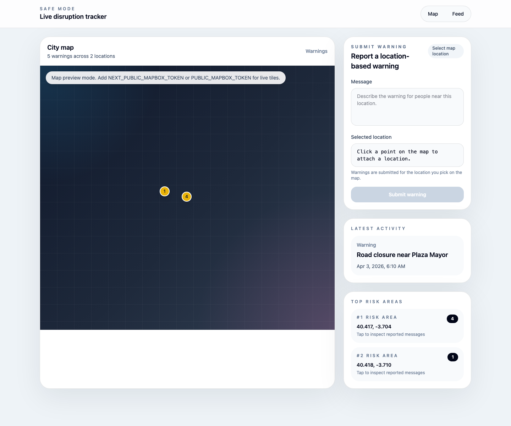

# Safe Mode SvelteKit

SvelteKit port of the Safe Mode “warnings by location” tracker. The app mirrors the existing Next.js version’s structure and interactions:

- Live map view with grouped location markers
- Warning submission flow backed by the same `/api/warnings` endpoint contract
- Right-rail location details, latest activity, and top risk areas
- Feed page for the most recent warnings
- Marker color threshold logic where `>= 10` warnings turns the marker red

## Screenshot



## Live Deployment

Production deployment is wired for Vercel through GitHub Actions.

- Production URL placeholder: `https://your-project-name.vercel.app`
- Update the README with your real Vercel URL after the first successful deploy

## Stack

- SvelteKit 2 + Svelte 5
- Tailwind CSS 4
- Mapbox GL JS
- Firebase Firestore
- Vitest + Testing Library
- Playwright
- Storybook

## Project Structure

```txt
src/
  components/
    EventsFeed.svelte
    LiveEventsDashboard.svelte
    MapView.svelte
    Marker.svelte
    SiteHeader.svelte
    WarningForm.svelte
    WarningPopup.svelte
  lib/
    api.ts
    location.ts
    types.ts
    utils.ts
    warning-marker-color.ts
    server/
      events.ts
      firebase.ts
  routes/
    +layout.svelte
    +page.svelte
    api/warnings/+server.ts
    feed/+page.svelte
```

## Environment Variables

Copy `.env.example` to `.env` and fill in the values you need:

```bash
NEXT_PUBLIC_MAPBOX_TOKEN=...
PUBLIC_MAPBOX_TOKEN=...

FIREBASE_API_KEY=...
FIREBASE_AUTH_DOMAIN=...
FIREBASE_PROJECT_ID=...
FIREBASE_STORAGE_BUCKET=...
FIREBASE_MESSAGING_SENDER_ID=...
FIREBASE_APP_ID=...
```

Notes:

- `NEXT_PUBLIC_MAPBOX_TOKEN` and `PUBLIC_MAPBOX_TOKEN` are both supported.
- If Firebase is not configured, the app falls back to an in-memory warnings store so local development and tests still work.

## Scripts

```bash
npm run dev
npm run build
npm run preview
npm run check
npm run lint
npm run format
npm run test
npm run test:component
npm run test:e2e
npm run storybook
npm run build-storybook
```

## Testing

- Component tests live next to the Svelte components and run with Vitest.
- End-to-end flows live in `e2e/` and run with Playwright.
- Storybook stories are provided for `Marker`, `WarningPopup`, and `WarningForm`.

## CI/CD

GitHub Actions workflow: `.github/workflows/ci.yml`

It will:

- install dependencies
- run linting and type checks
- build the SvelteKit app
- run Vitest component tests
- run Playwright e2e tests
- build Storybook
- deploy to Vercel on `main` when `VERCEL_TOKEN`, `VERCEL_ORG_ID`, and `VERCEL_PROJECT_ID` are configured

## Notes

- `build-storybook` uses a temporary working copy under `/tmp` to avoid inherited Yarn Plug'n'Play manifests that may exist outside this repo.
- The app uses the same `/api/warnings` response shapes as the Next.js version:
  - `GET /api/warnings` -> `{ warnings }`
  - `POST /api/warnings` -> `{ warning }`
